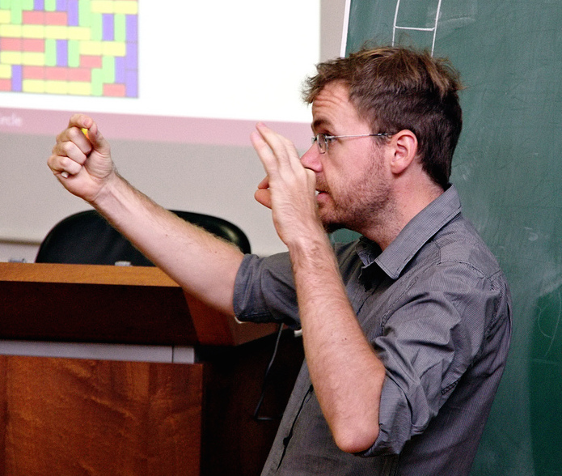

.. title:: Home

Vincent Beffara
===============

Welcome to my web page. Here, you will find a description of my past and
current research (full list below), as well as pictures of mathematical
objects and some notes on simulations.

Research
--------

I am a *directeur de recherche* at the *Institut Fourier* in Grenoble,
and a member of the probability team. My main research interest is in
statistical physics, especially the study of critical phenomena in two
dimensions. I spent most of the academic years 2013-2015 in Bonn,
Germany (at the Max-Planck Institut and then the Hausdorff Center), and
was previously at the École Normale Supérieure in Lyon.

Images and simulations
----------------------

During my PhD and since then, I produced quite a few pictures of various two-
dimensional objects, especially of SLE processes. Some of them can be found
`here <pictures.html>`__, and a few comments about the programs used to generate
them are gathered `here <simulations.html>`__ (I am planning to set up separate
pages for a few of the programs, which will be linked from there too).

.. toctree::
   :maxdepth: 1
   :hidden:

   self
   simulations
