Pictures
========

Here are some pictures I produced of various random two-dimensional
objects. In each case there is a small preview, and the full-resolution
image itself is linked in case you would like to download it (some of
the files can be quite large!). There is a discussion about some of the
simulations themselves on `this page <simulations>`__, and if I get the
motivation someday I might set up separate pages for each model.

**“Terms of use:”** You can use any one of the images on this page in
any way you see fit; just let me know when you do so.

One last thing: If you need pictures with a higher definition (or
pictures of something else that I did not put here but might have
simulated already), just ask!

--------------

|DLA.1000| `A DLA cluster of size 2000 <_static/sims/DLA.1000.png>`_

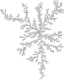

|DLA.2000| `A DLA cluster of size 4096 <_static/sims/DLA.2000.png>`_

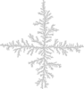

|DLA.4000| `A DLA cluster of size 8192 <_static/sims/DLA.4000.png>`_

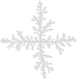

|Ising-0.881-1000| `An Ising configuration (beta=0.881374) <_static/sims/Ising-0.881-1000.png>`_

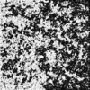

|Ising-0.900-1000| `An Ising configuration (beta=0.900000) <_static/sims/Ising-0.900-1000.png>`_

.. |Ising-0.900-1000| image:: _static/sims/thumbs/Ising-0.900-1000.png

|LERW| `A loop-erased walk of size 2000 <_static/sims/LERW.png>`_

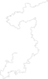

|Lines| `Broken line process <_static/sims/Lines.png>`_

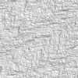

|Perco-bond| `Bond-percolation cluster (p=0.500000) <_static/sims/Perco-bond.png>`_

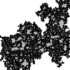

|Perco-site| `Site-percolation cluster (p=0.580000) <_static/sims/Perco-site.png>`_

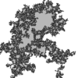

|Perco.grad| `Gradient percolation cluster <_static/sims/Perco.grad.png>`_

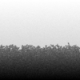

|Piv| `A pivoting point of angle pi/2 <_static/sims/Piv.png>`_

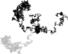

|SAW| `A self-avoiding walk of length 10000 <_static/sims/SAW.png>`_

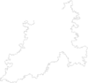

|SLE-1-1000-2085690| `Schramm’s SLE Process (kappa=1.000000) <_static/sims/SLE-1-1000-2085690.png>`_

|SLE-1-500-20856904| `Schramm’s SLE Process (kappa=1.000000) <_static/sims/SLE-1-500-20856904.png>`_

|SLE-2-1000-2085690| `Schramm’s SLE Process (kappa=2.000000) <_static/sims/SLE-2-1000-2085690.png>`_

|SLE-2-500-20856904| `Schramm’s SLE Process (kappa=2.000000) <_static/sims/SLE-2-500-20856904.png>`_

|SLE-3-1000-2085690| `Schramm’s SLE Process (kappa=3.000000) <_static/sims/SLE-3-1000-2085690.png>`_

|SLE-3-500-20856904| `Schramm’s SLE Process (kappa=3.000000) <_static/sims/SLE-3-500-20856904.png>`_

|SLE-3.5-1000-2085690| `Schramm’s SLE Process (kappa=3.500000) <_static/sims/SLE-3.5-1000-2085690.png>`_

|SLE-4-1000-2085690| `Schramm’s SLE Process (kappa=4.000000) <_static/sims/SLE-4-1000-2085690.png>`_

|SLE-4-500-20856904| `Schramm’s SLE Process (kappa=4.000000) <_static/sims/SLE-4-500-20856904.png>`_

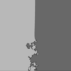

|SLE-4.5-1000-2085690| `Schramm’s SLE Process (kappa=4.500000) <_static/sims/SLE-4.5-1000-2085690.png>`_

|SLE-5-1000-2085690| `Schramm’s SLE Process (kappa=5.000000) <_static/sims/SLE-5-1000-2085690.png>`_

.. |SLE-5-1000-2085690| image:: _static/sims/thumbs/SLE-5-1000-2085690.png

|SLE-5-500-20856904| `Schramm’s SLE Process (kappa=5.000000) <_static/sims/SLE-5-500-20856904.png>`_

.. |SLE-5-500-20856904| image:: _static/sims/thumbs/SLE-5-500-20856904.png

|SLE-6-1000-2085690| `Schramm’s SLE Process (kappa=6.000000) <_static/sims/SLE-6-1000-2085690.png>`_

|SLE-6-2000| `Schramm’s SLE Process (kappa=6.000000) <_static/sims/SLE-6-2000.png>`_

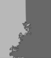

|SLE-6-500-20856904| `Schramm’s SLE Process (kappa=6.000000) <_static/sims/SLE-6-500-20856904.png>`_

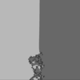

|SLE-7-1000-2085690| `Schramm’s SLE Process (kappa=7.000000) <_static/sims/SLE-7-1000-2085690.png>`_

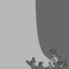

|SLE-7-500-20856904| `Schramm’s SLE Process (kappa=7.000000) <_static/sims/SLE-7-500-20856904.png>`_

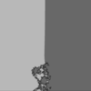

|SLE-8-1000-2085690| `Schramm’s SLE Process (kappa=8.000000) <_static/sims/SLE-8-1000-2085690.png>`_

.. |SLE-8-1000-2085690| image:: _static/sims/thumbs/SLE-8-1000-2085690.png

|SLE-8-500-20856904| `Schramm’s SLE Process (kappa=8.000000) <_static/sims/SLE-8-500-20856904.png>`_

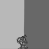
