Pictures
========

Here are some pictures I produced of various random two-dimensional objects. In
each case there is a small preview, and the full-resolution image itself is
linked in case you would like to download it (some of the files can be quite
large!). There is a discussion about some of the simulations themselves on
:doc:`this page <simulations>` and if I get the motivation someday I might set
up separate pages for each model.

**"Terms of use:"** You can use any one of the images on this page in
any way you see fit; just let me know when you do so.

One last thing: If you need pictures with a higher definition (or
pictures of something else that I did not put here but might have
simulated already), just ask!

--------------

|DLA.1000| :download:`A DLA cluster of size 2000 <sims/DLA.1000.png>`

|DLA.2000| :download:`A DLA cluster of size 4096 <sims/DLA.2000.png>`

|DLA.4000| :download:`A DLA cluster of size 8192 <sims/DLA.4000.png>`

|Ising-0.881-1000| :download:`An Ising configuration (beta=0.881374) <sims/Ising-0.881-1000.png>`

|Ising-0.900-1000| :download:`An Ising configuration (beta=0.900000) <sims/Ising-0.900-1000.png>`

|LERW| :download:`A loop-erased walk of size 2000 <sims/LERW.png>`

|Lines| :download:`Broken line process <sims/Lines.png>`

|Perco-bond| :download:`Bond-percolation cluster (p=0.500000) <sims/Perco-bond.png>`

|Perco-site| :download:`Site-percolation cluster (p=0.580000) <sims/Perco-site.png>`

|Perco.grad| :download:`Gradient percolation cluster <sims/Perco.grad.png>`

|Piv| :download:`A pivoting point of angle pi/2 <sims/Piv.png>`

|SAW| :download:`A self-avoiding walk of length 10000 <sims/SAW.png>`

|SLE-1-1000-2085690| :download:`Schramm’s SLE Process (kappa=1.000000) <sims/SLE-1-1000-2085690.png>`

|SLE-1-500-20856904| :download:`Schramm’s SLE Process (kappa=1.000000) <sims/SLE-1-500-20856904.png>`

|SLE-2-1000-2085690| :download:`Schramm’s SLE Process (kappa=2.000000) <sims/SLE-2-1000-2085690.png>`

|SLE-2-500-20856904| :download:`Schramm’s SLE Process (kappa=2.000000) <sims/SLE-2-500-20856904.png>`

|SLE-3-1000-2085690| :download:`Schramm’s SLE Process (kappa=3.000000) <sims/SLE-3-1000-2085690.png>`

|SLE-3-500-20856904| :download:`Schramm’s SLE Process (kappa=3.000000) <sims/SLE-3-500-20856904.png>`

|SLE-3.5-1000-2085690| :download:`Schramm’s SLE Process (kappa=3.500000) <sims/SLE-3.5-1000-2085690.png>`

|SLE-4-1000-2085690| :download:`Schramm’s SLE Process (kappa=4.000000) <sims/SLE-4-1000-2085690.png>`

|SLE-4-500-20856904| :download:`Schramm’s SLE Process (kappa=4.000000) <sims/SLE-4-500-20856904.png>`

|SLE-4.5-1000-2085690| :download:`Schramm’s SLE Process (kappa=4.500000) <sims/SLE-4.5-1000-2085690.png>`

|SLE-5-1000-2085690| :download:`Schramm’s SLE Process (kappa=5.000000) <sims/SLE-5-1000-2085690.png>`

|SLE-5-500-20856904| :download:`Schramm’s SLE Process (kappa=5.000000) <sims/SLE-5-500-20856904.png>`

|SLE-6-1000-2085690| :download:`Schramm’s SLE Process (kappa=6.000000) <sims/SLE-6-1000-2085690.png>`

|SLE-6-2000| :download:`Schramm’s SLE Process (kappa=6.000000) <sims/SLE-6-2000.png>`

|SLE-6-500-20856904| :download:`Schramm’s SLE Process (kappa=6.000000) <sims/SLE-6-500-20856904.png>`

|SLE-7-1000-2085690| :download:`Schramm’s SLE Process (kappa=7.000000) <sims/SLE-7-1000-2085690.png>`

|SLE-7-500-20856904| :download:`Schramm’s SLE Process (kappa=7.000000) <sims/SLE-7-500-20856904.png>`

|SLE-8-1000-2085690| :download:`Schramm’s SLE Process (kappa=8.000000) <sims/SLE-8-1000-2085690.png>`

|SLE-8-500-20856904| :download:`Schramm’s SLE Process (kappa=8.000000) <sims/SLE-8-500-20856904.png>`

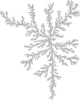
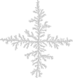
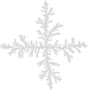
.. |Ising-0.881-1000| image:: sims/thumbs/Ising-0.881-1000.png
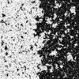
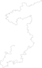
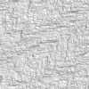
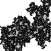
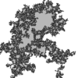

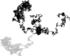
.. |SAW| image:: sims/thumbs/SAW.png

.. |SLE-1-500-20856904| image:: sims/thumbs/SLE-1-500-20856904.png

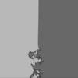

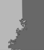
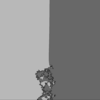

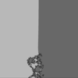

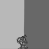
